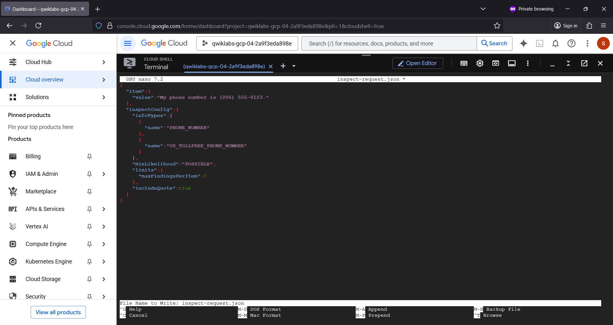
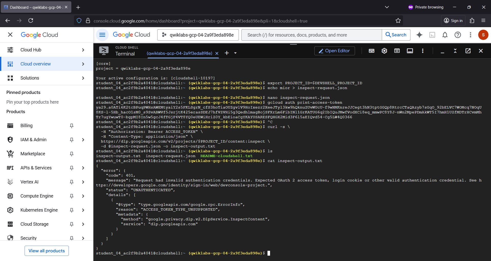
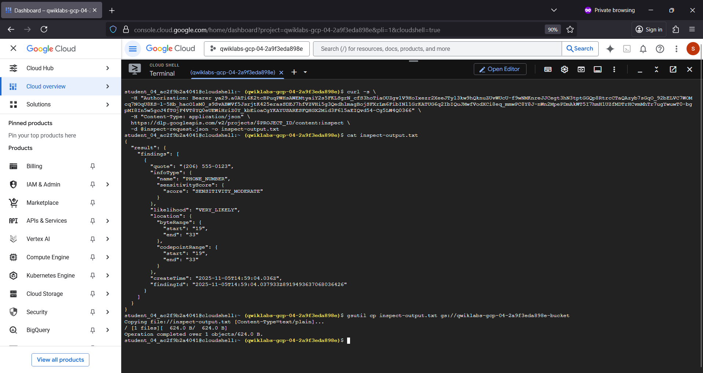
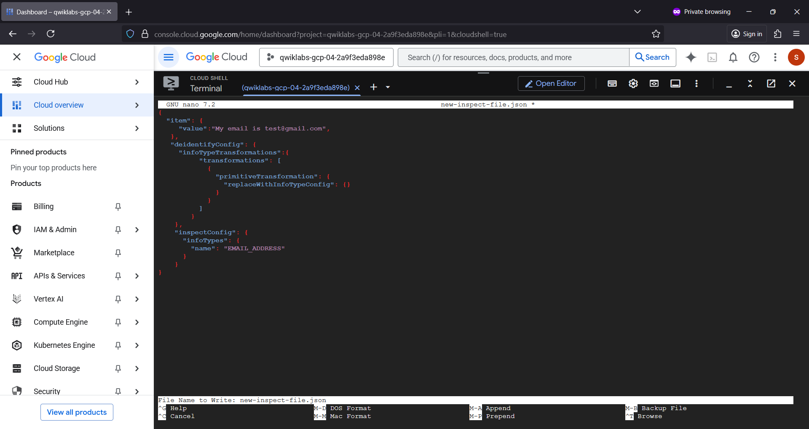
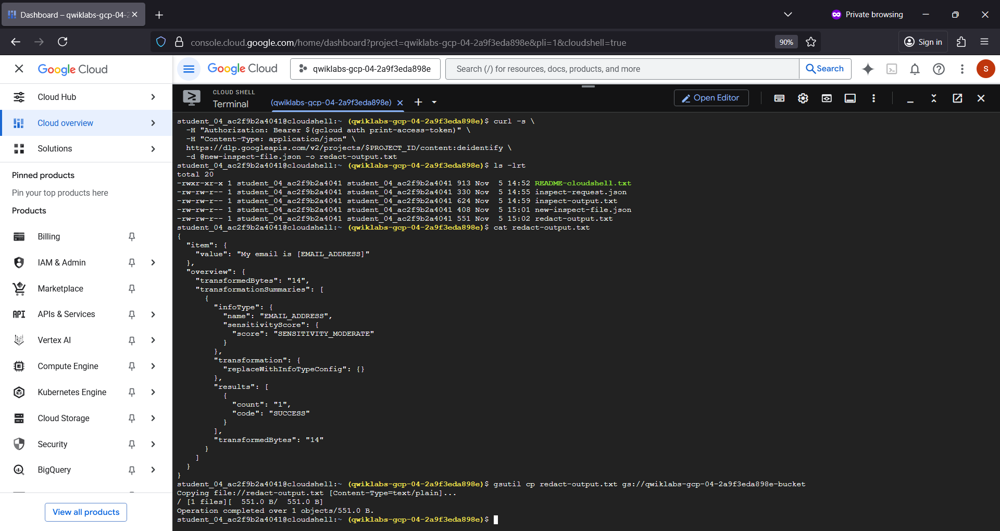
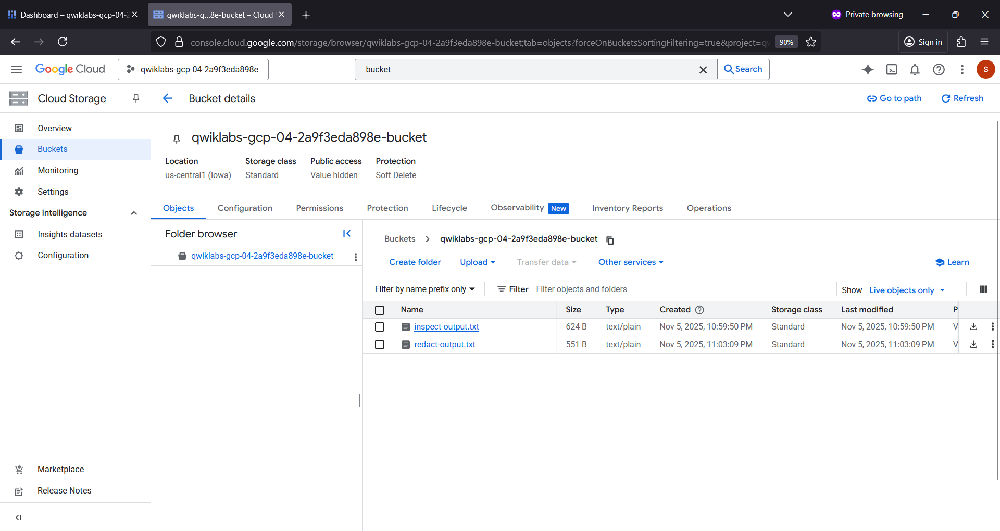
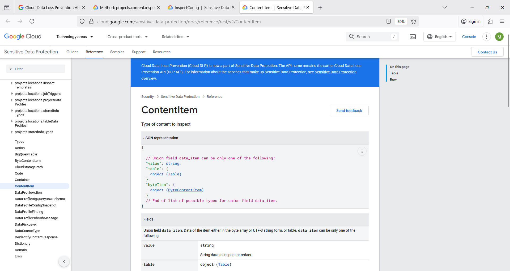
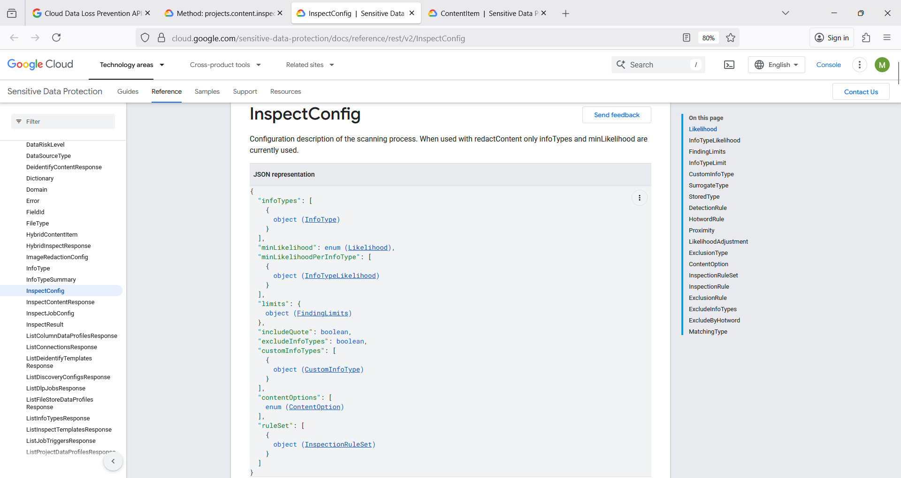
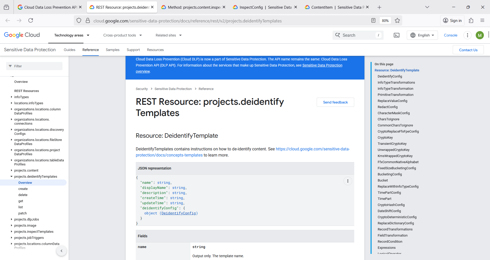

# dlpapi 🦹👮💸
dlpapi : Cloud Data Loss Prevention # DLP API # Sensitive PII Data Protection # Redaction

## Objective
- Use DLP API to :
    - Inspect string for sensitive information
    - Redact sensitive data from text content

# Cloud Data Loss Prevention API

